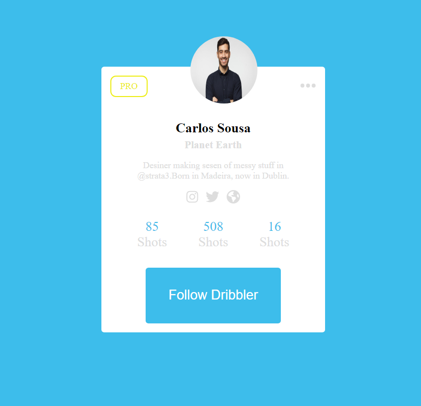

# nice-card
Nice Card is a practice about html and css specefic flex box.

 

## Live Deom: https://ahmed-abo-rafat.github.io/nice-card/

## Technologies
Project is created with:
  - HTML
  - CSS
  - Flex Box

